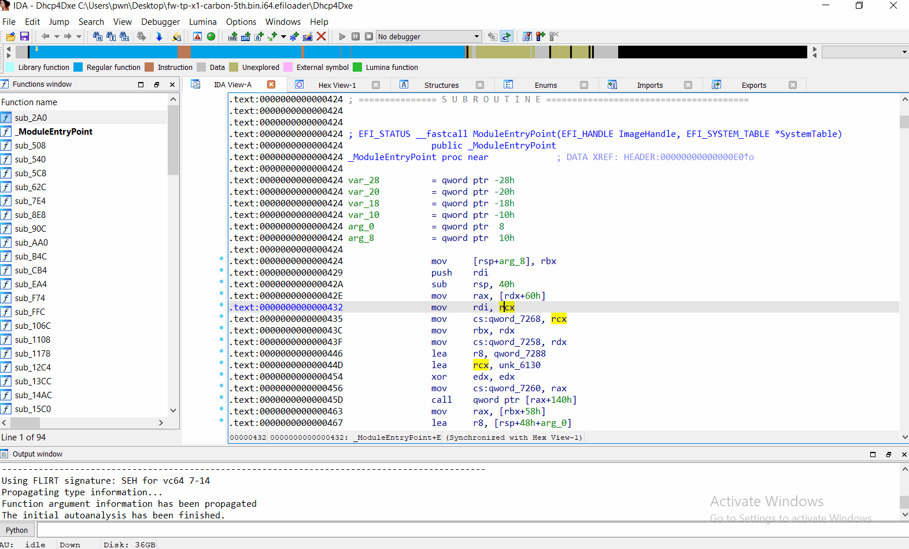
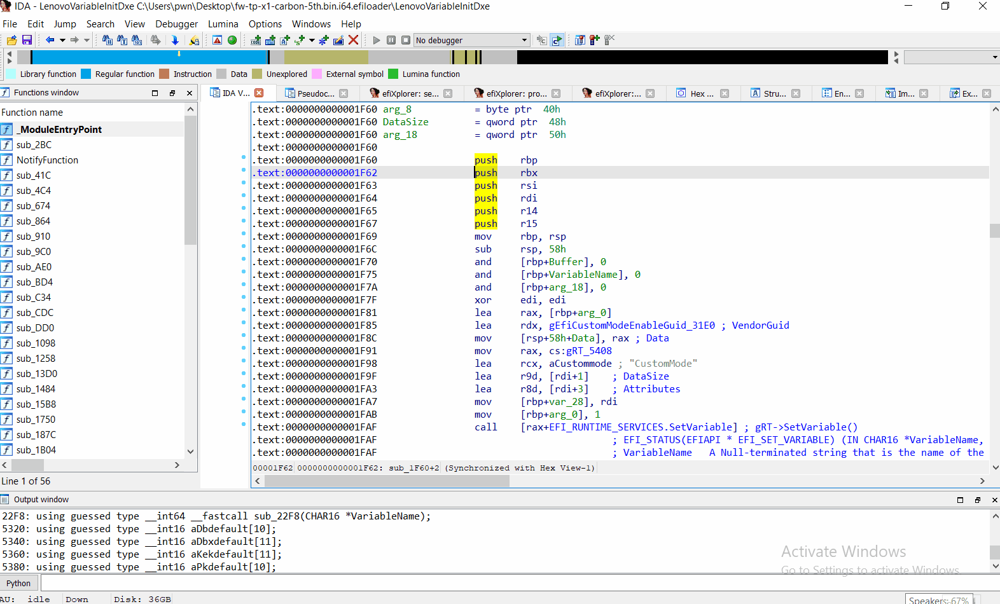
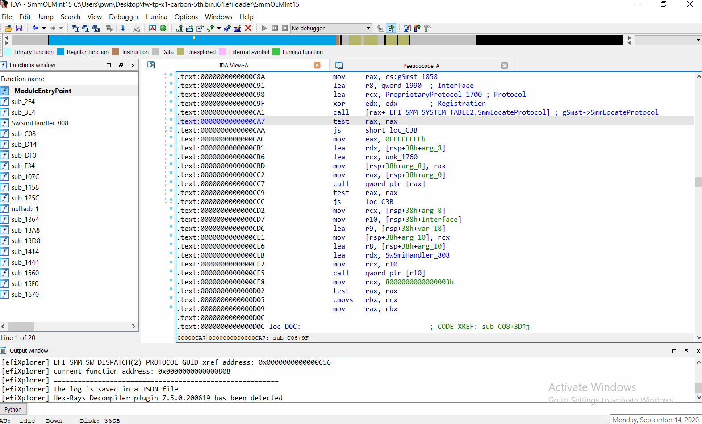
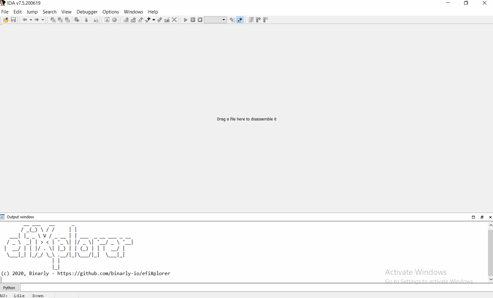
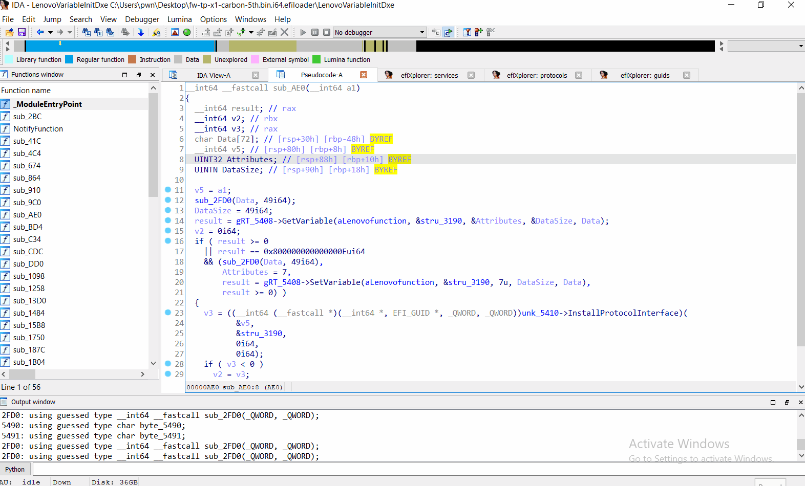
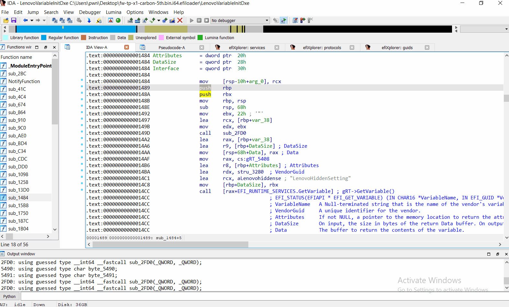
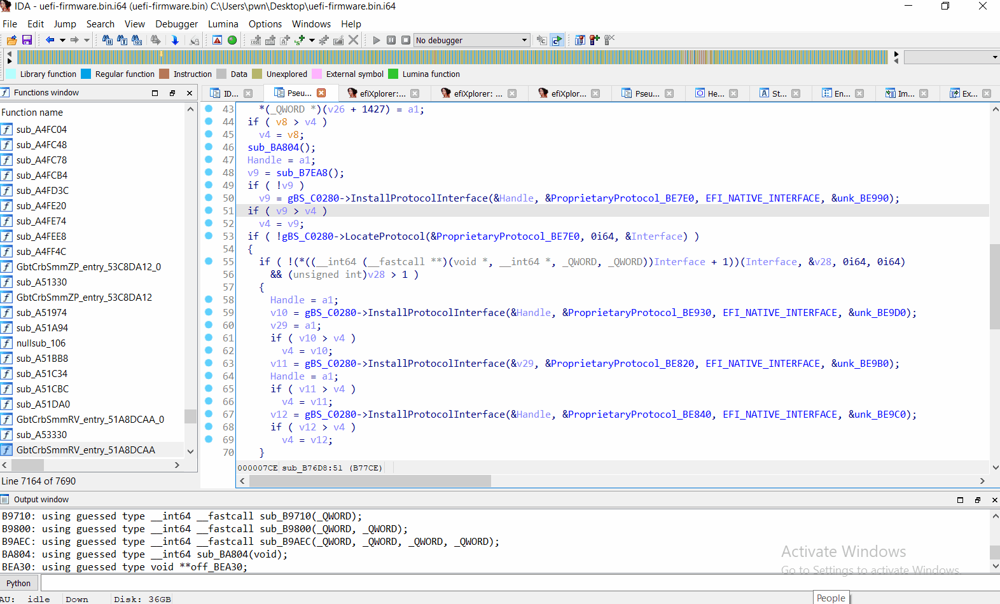
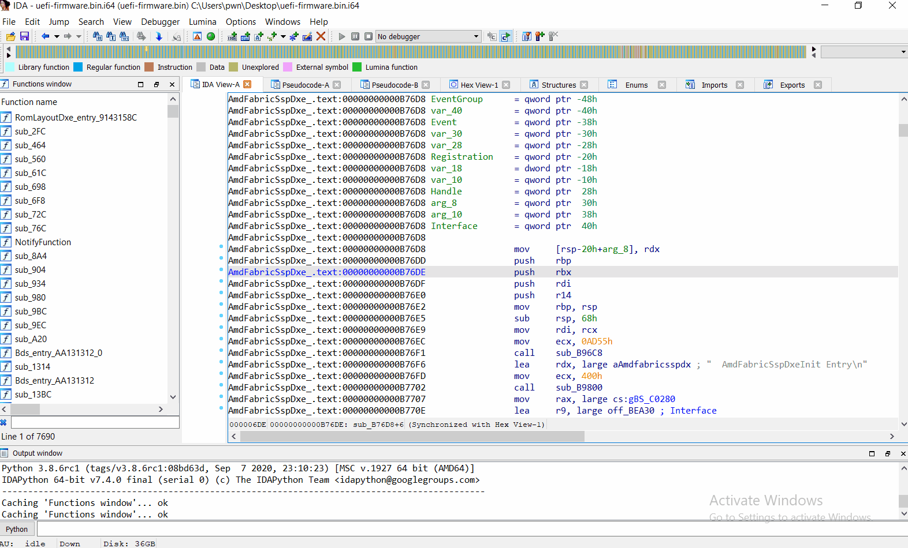
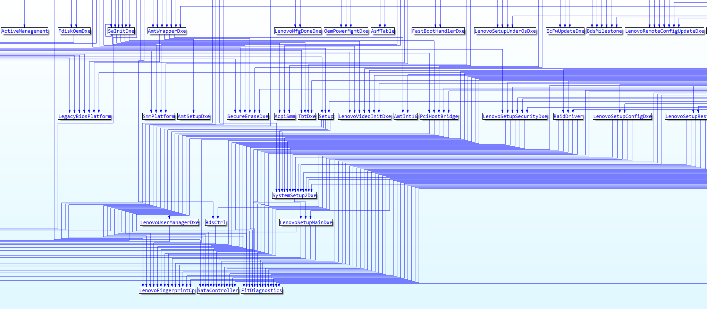

[](http://www.gnu.org/licenses/gpl-3.0)

**efiXplorer** - IDA plugin for UEFI firmware analysis and reverse engineering automation

__Contributors__: 
* Alex Matrosov ([@matrosov](https://github.com/matrosov))
* Andrey Labunets ([@isciurus](https://github.com/isciurus))
* Philip Lebedev ([@p41l](https://github.com/p41l/))
* Yegor Vasilenko ([@yeggor](https://github.com/yeggor/))

__Supported versions of Hex-Rays products:__ everytime we focus on last versions of IDA and Decompiler because we try to use most recent features from new SDK releases. That means we tested only on recent versions of Hex-Rays products and do not guarantee stable work on previous generations.

__Why not IDApython:__ all code developed in C++ because it's a more stable and performant way to support a complex plugin and get full power of most recent SDK's features.

__Supported Platforms:__ Windows, Linux and OSX (x86/x64).


# efiXplorer Key features

## Identify available Boot Services automatically

Annotate Boot Services calls in assembly code automatically



## Identify available Runtime Services automatically

Annotate Runtime Services calls in assembly code automatically



## Identify available SMM services automatically

Annotate SMM Services calls in assembly code automatically



## Identify available PEI services automatically

Annotate PEI Services calls in assembly code automatically




## Identify available EFI Protocols automatically

* Build the list of EFI Protocols firmware consumes and installes



## Identify known EFI GUID's

* Build the list of identified EFI GUID's (including protocol names for known GUIDS)



# efiXloader Key features

* `efiXloader` is an IDA Pro loader module, responsible for processing UEFI drivers within single IDA Pro instance.


## UEFI drivers entry points identification

* During UEFI drivers analysis `efiXloader` identifies each driver's entry.



## Navigation between different UEFI drivers

* Each UEFI driver is accessible within single IDA Pro instance for reverse-engineering.


## UEFI drivers extraction

* All processed UEFI drivers are dropped into prepared folder.


## efiXplorer + efiXloader in action

* All `efiXplorer` analysis capabilities can be applied to the whole UEFI firmware image (instead of reverse-engineering each single executable in a separate IDA session)


## SMI handlers identification within the whole firmware



## Dependency graph between DXE drivers

In conjunction with the loader efiXplorer can build a dependency graph between DXE drivers based on protocols usage.



# Build instruction

We try to make the build process for all supported platforms very simple, just use the build script to automate this process.

## Build script

```
Usage: build.py [OPTIONS] IDASDK_DIR

Options:
  --copy TEXT  path to IDA plugins directory
  --help       Show this message and exit.
```

example of build process:

```bash
./build.py <IDASDK75_DIR>
```

## Compilation with cmake

```
mkdir build
cd build
cmake .. -DIdaSdk_ROOT_DIR="/path/to/idasdk"
cmake --build . --config Release
```

## efiXloader compilation and installation

The common steps are next.

```bash
cd efiXloader
mkdir build
cd build
cmake .. -DIdaSdk_ROOT_DIR="/path/to/idasdk"
cmake --build . --config Release
```

# Installation

## efiXplorer

Copy compiled binaries of `efiXplorer` plugin and `guids` directory to `<IDA_DIR>/plugins`. Enjoy!

## efiXloader

Copy `builds/efiXloader64.dll` to `<IDA_DIR>/loaders`.

# Features summary table

| Feature \ Bitness | 32-bit | 64-bit |
| --- | --- | --- |
| Boot Services | + | + |
| Runtime Services | + | + |
| SMM services | - | + |
| PEI Services | + | - |
| Protocols | + | + |
| GUIDS | + | + | 
| Loader | - | + |
| Dependency graph | - | + |

# References

* https://github.com/LongSoft/UEFITool
* https://github.com/yeggor/UEFI_RETool
* https://github.com/gdbinit/EFISwissKnife
* https://github.com/snare/ida-efiutils
* https://github.com/al3xtjames/ghidra-firmware-utils
* https://github.com/DSecurity/efiSeek
