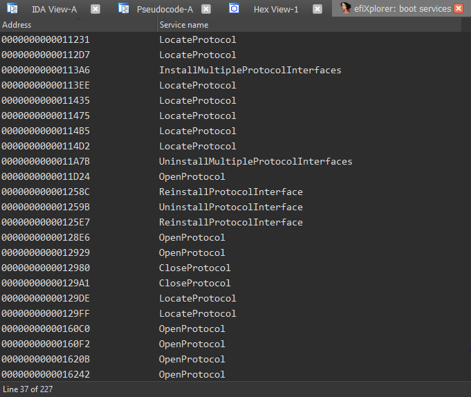
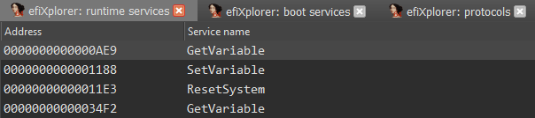

[](http://www.gnu.org/licenses/gpl-3.0)

# efiXplorer

IDA plugin for UEFI firmware analysis.

# Key features

## Boot services finding

* boot services found in a separate window

    

* descriptions of found boot services are put down in a comment

    

## Runtime services finding

* runtime services found in a separate window

    

* descriptions of found runtime services are put down in a comment

    

## Protocols finding

* protocols found in a separate window

    

## Known guids finding

* guids found in a separate window

    

# Build instruction

## Build script

```
Usage: build.py [OPTIONS] IDASDK_DIR

Options:
  -c, --copy TEXT  path to IDA plugins directory
  --help           Show this message and exit.
```

## Build example

```bash
./build.py <IDASDK_DIR>
```

# Contributors

* Alex Matrosov ([@matrosov](https://github.com/matrosov))
* Andrey Labunets ([@isciurus](https://github.com/isciurus))
* Philip Lebedev ([@p41l](https://github.com/p41l/))
* Yegor Vasilenko ([@yeggor](https://github.com/yeggor/))

# Credits

* https://github.com/yeggor/UEFI_RETool (the key idea and many implementation methods are taken from this project)
* https://github.com/gdbinit/EFISwissKnife (descriptions of boot services and runtime services are taken from this project)
