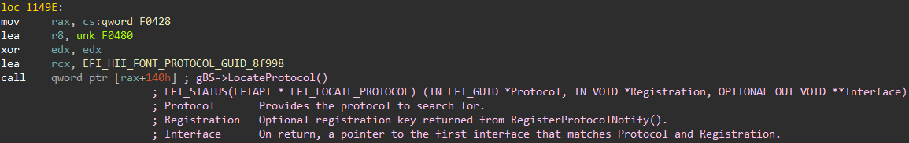
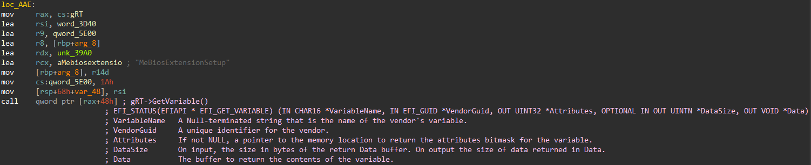
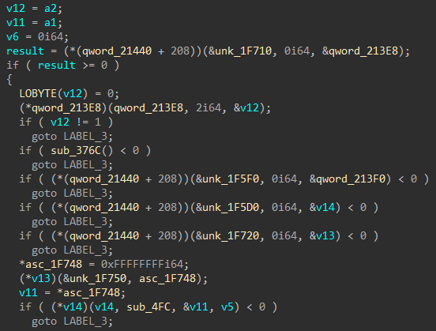
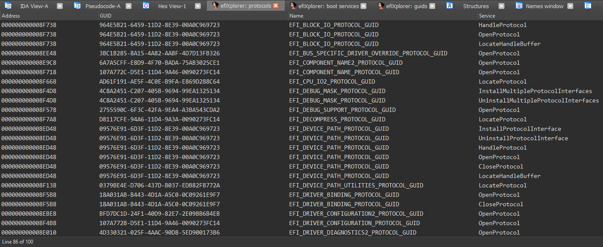
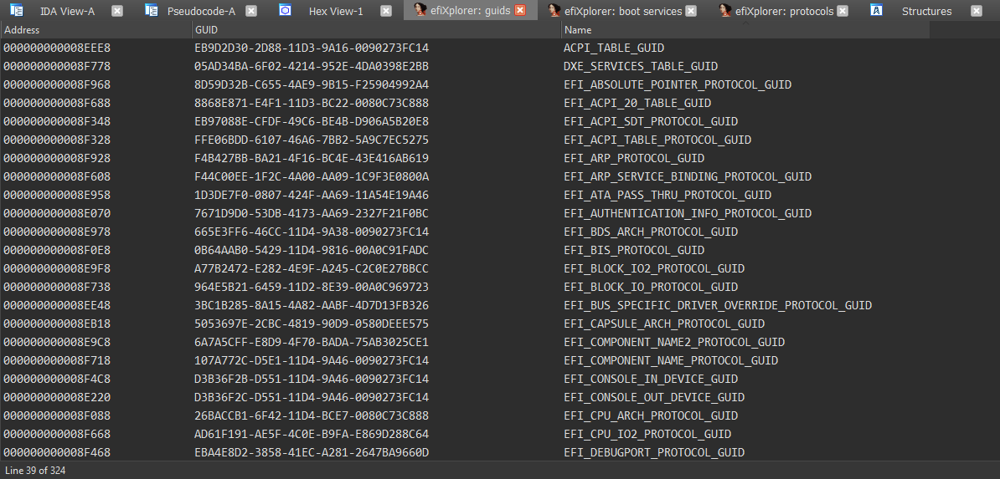
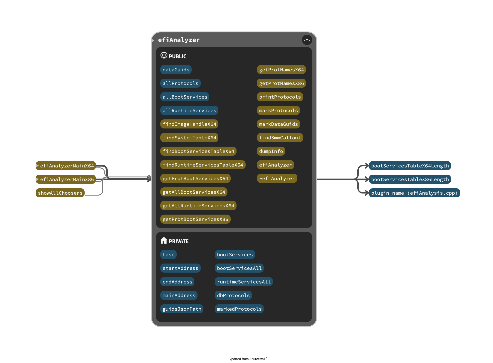

[](http://www.gnu.org/licenses/gpl-3.0)
[](https://gitter.im/efiXplorer/dev?utm_source=badge&utm_medium=badge&utm_campaign=pr-badge&utm_content=badge)

**efiXplorer** - IDA plugin for UEFI firmware analysis and reverse engineering automation :octocat:

__Contributors__: 
* Alex Matrosov ([@matrosov](https://github.com/matrosov))
* Andrey Labunets ([@isciurus](https://github.com/isciurus))
* Philip Lebedev ([@p41l](https://github.com/p41l/))
* Yegor Vasilenko ([@yeggor](https://github.com/yeggor/))

__Supported versions of Hex-Rays products:__ everytime we focus on last versions of IDA and Decompiler because trying to use most recent features from new SDK releases. That means we tested only on recent versions of Hex-Rays products and do not guarantee stable work on previous generations.

__Why not IDApython:__ all code developed in C++ because it's a more stable and performant way to support a complex plugin and get full power of most recent SDK's features.

__Supported Platforms:__ Win, Linux and OSX (x86/x64).


# Key features

## Identify available Boot Services automatically

Annotate assembly code automatically with available Boot Services



## Identify available Runtime Services automatically

Annotate assembly code automatically with available Runtime Services



## Identify available SMM Services automatically

| Before analysis | After analysis |
| --- | --- |
|  |  |

## Identify available EFI Protocols automatically

* Build the list of available EFI Protocols

    

## Identify known EFI GUID's

* Build the list of available EFI GUID's (including protocol name identification)

    

# efiXplorer Architecture

From the beginning of the project, we focus on building extensible architecture to make our  life easier to support the current version and adding new features :rocket:



# Build instruction

We try to make the build process for different platforms very simple, just use the build script to automate this process🐍

## Build script

```
Usage: build.py [OPTIONS] IDASDK_DIR

Options:
  -c, --copy TEXT  path to IDA plugins directory
  --help           Show this message and exit.
```

example of build process:

```bash
./build.py <IDASDK75_DIR>
```

# Installation

Copy compiled binaries of efiXplorer plugin and `guids` directory to `<IDA_DIR>/plugins`. Enjoy!

# Publications
* [How efiXplorer helping to solve challenges in reverse engineering of UEFI firmware](https://www.youtube.com/watch?v=FFGQJBmRkLw)

# References 
__For IDA:__
* https://github.com/yeggor/UEFI_RETool 
* https://github.com/gdbinit/EFISwissKnife 
* https://github.com/snare/ida-efiutils

__For Ghidra:__
* https://github.com/al3xtjames/ghidra-firmware-utils
* https://github.com/DSecurity/efiSeek

